# NFPC Phase 1 — Exploratory Data Analysis Report

**Team Submission** | National Fraud Prevention Challenge (NFPC)

Reserve Bank Innovation Hub (RBIH) × IIT Delhi TRYST


---


## 1. Data Loading & Schema Understanding

### 1.1 Dataset Overview


| Table | Rows | Columns |

|---|---|---|

| `customers` | 39,988 | 14 |

| `accounts` | 40,038 | 22 |

| `transactions` | 7,424,845 | 8 |

| `linkage` | 40,038 | 2 |

| `products` | 39,988 | 11 |

| `train_labels` | 24,023 | 5 |

| `test_accounts` | 16,015 | 1 |


### 1.2 Entity Relationships


```

customers ──(customer_id)──> linkage ──(account_id)──> accounts

                                                           │

                                                      (account_id)

                                                           │

                                                           v

                                                      transactions


customers ──(customer_id)──> product_details

accounts  ──(account_id)──> train_labels / test_accounts

```


### 1.3 Missing Values Summary


| Table | Column | Missing Count | Missing % |

|---|---|---|---|

| `customers` | `pan_available` | 5,732 | 14.3% |

| `customers` | `aadhaar_available` | 9,708 | 24.3% |

| `accounts` | `branch_pin` | 2,009 | 5.0% |

| `accounts` | `avg_balance` | 1,203 | 3.0% |

| `accounts` | `last_mobile_update_date` | 34,001 | 84.9% |

| `accounts` | `monthly_avg_balance` | 1,203 | 3.0% |

| `accounts` | `freeze_date` | 38,721 | 96.7% |

| `accounts` | `unfreeze_date` | 39,613 | 98.9% |

| `products` | `loan_sum` | 31,485 | 78.7% |

| `products` | `cc_sum` | 33,687 | 84.2% |

| `train_labels` | `mule_flag_date` | 23,760 | 98.9% |

| `train_labels` | `alert_reason` | 23,781 | 99.0% |

| `train_labels` | `flagged_by_branch` | 23,760 | 98.9% |


## 2. Target Variable Deep Analysis

**Class Distribution:** 23,760 legitimate (98.9%) vs 263 mule (1.09%)


> **Critical Observation:** Extreme class imbalance with only ~1.1% mule accounts. This imbalance ratio of ~90:1 requires careful handling in modeling (SMOTE, class weights, focal loss).


### 2.1 Alert Reason Analysis


| Alert Reason | Count | % of Mules |

|---|---|---|

| Routine Investigation | 55 | 20.9% |

| Rapid Movement of Funds | 22 | 8.4% |

| Structuring Transactions Below Threshold | 18 | 6.8% |

| Branch Cluster Investigation | 17 | 6.5% |

| Dormant Account Reactivation | 17 | 6.5% |

| Income-Transaction Mismatch | 17 | 6.5% |

| Unusual Fund Flow Pattern | 17 | 6.5% |

| High-Value Activity on New Account | 16 | 6.1% |

| Post-Contact-Update Spike | 14 | 5.3% |

| Geographic Anomaly Detected | 13 | 4.9% |

| Layered Transaction Pattern | 12 | 4.6% |

| Round Amount Pattern | 12 | 4.6% |

| Salary Cycle Anomaly | 12 | 4.6% |


### 2.2 Temporal Distribution of Mule Flagging


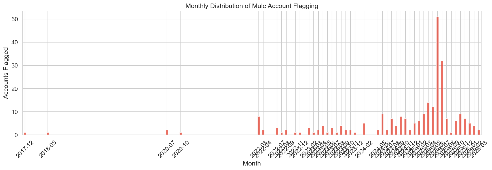


### 2.3 Branch Flagging Concentration


- **Total branches that flagged mules:** 162

- **Top 5 branches account for:** 39.2% of all mule flags


## 3. Account-Level EDA (Mule vs Legitimate)

### 3.1 Balance Distributions


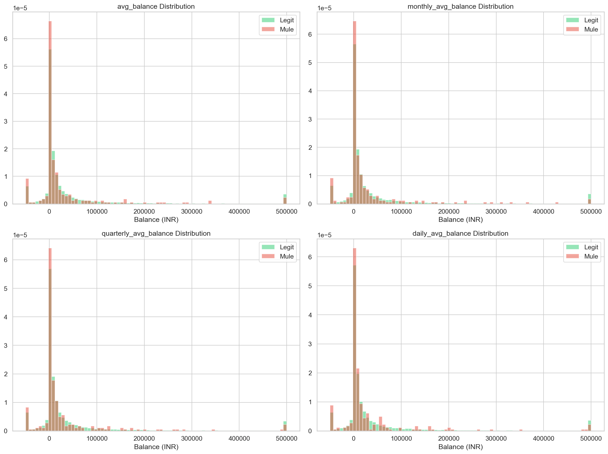

| Metric | Legitimate (Mean) | Mule (Mean) | Legitimate (Median) | Mule (Median) |

|---|---|---|---|---|

| `avg_balance` | ₹53,282 | ₹-26,562 | ₹5,260 | ₹3,561 |

| `monthly_avg_balance` | ₹52,861 | ₹-20,981 | ₹5,214 | ₹3,394 |

| `quarterly_avg_balance` | ₹51,438 | ₹-23,227 | ₹5,130 | ₹3,391 |

| `daily_avg_balance` | ₹53,232 | ₹-15,792 | ₹5,079 | ₹3,190 |


### 3.2 Product Family Distribution


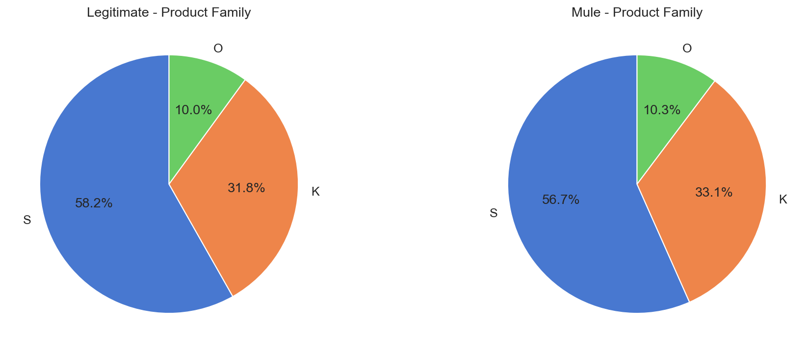


### 3.3 Account Status


| Status | Legitimate | Mule | Legit % | Mule % |

|---|---|---|---|---|

| active | 23,275 | 158 | 98.0% | 60.1% |

| frozen | 485 | 105 | 2.0% | 39.9% |


### 3.4 Account Age Analysis


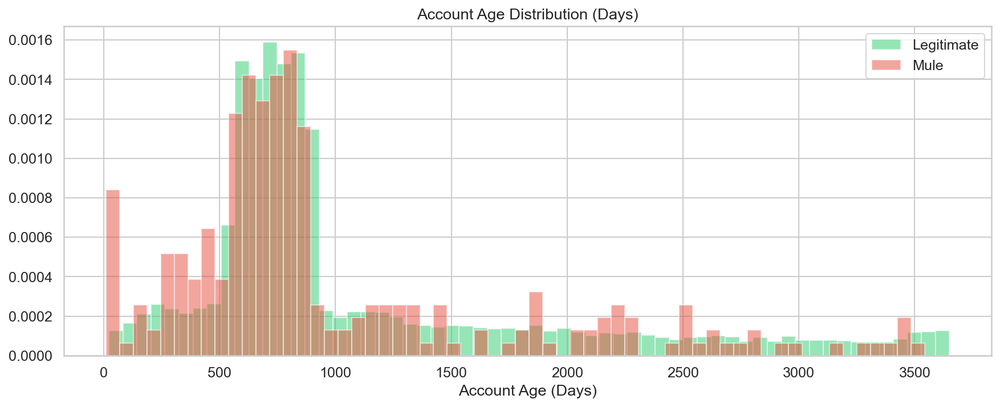

- **Legitimate median account age:** 805 days

- **Mule median account age:** 751 days


### 3.5 KYC & Compliance Flags


| Flag | Legit Y% | Mule Y% | Difference |

|---|---|---|---|

| `kyc_compliant` | 90.0% | 91.6% | +1.6pp |

| `nomination_flag` | 60.4% | 58.9% | -1.5pp |

| `cheque_allowed` | 90.0% | 89.7% | -0.2pp |

| `cheque_availed` | 36.2% | 39.9% | +3.7pp |

| `rural_branch` | 11.7% | 16.0% | +4.3pp |


### 3.6 Freeze/Unfreeze Pattern


- **Accounts ever frozen:** Legitimate 3.0% | Mule 58.9%

- **Freeze rate difference:** +56.0 percentage points


## 4. Customer-Level EDA

### 4.1 Demographics


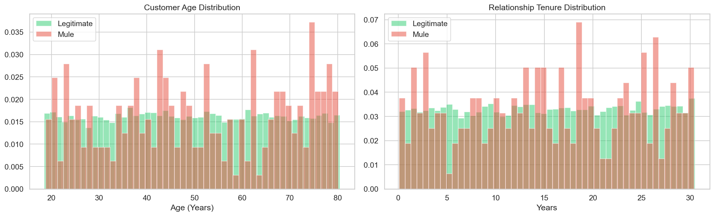

- **Legit median age:** 49.5 yrs | **Mule:** 49.8 yrs

- **Legit median tenure:** 15.4 yrs | **Mule:** 15.5 yrs


### 4.2 KYC Document Availability


| Document | Legit Y% | Mule Y% | Difference |

|---|---|---|---|

| `pan_available` | 83.2% | 82.5% | -0.7pp |

| `aadhaar_available` | 47.1% | 38.0% | -9.1pp |

| `passport_available` | 17.8% | 15.2% | -2.6pp |


### 4.3 Digital Banking Adoption


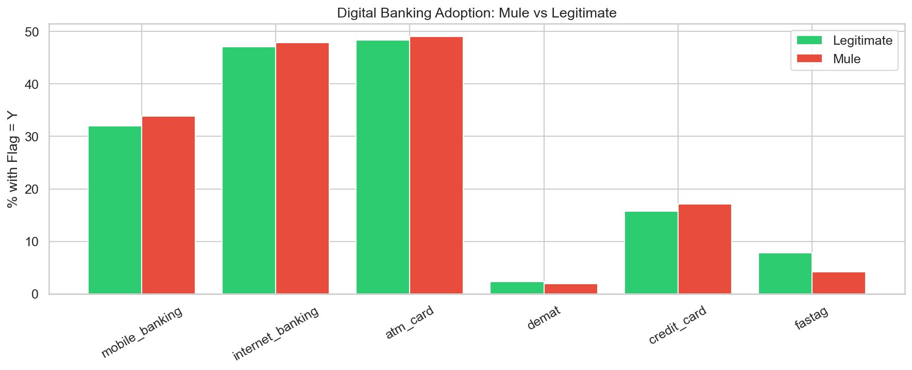


### 4.4 Multi-Account Analysis


- **Multi-account holders:** Legitimate 0.2% | Mule 3.8%


## 5. Transaction-Level EDA

### 5.1 Transaction Volume & Amount Distribution


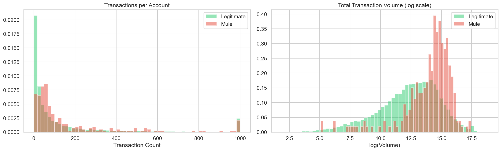

| Metric | Legitimate (Median) | Mule (Median) | Ratio |

|---|---|---|---|

| `txn_count` | 38.0 | 67.5 | 1.78x |

| `total_volume` | 314,056.3 | 1,984,011.1 | 6.32x |

| `avg_amount` | 7,423.5 | 14,852.3 | 2.00x |

| `unique_counterparties` | 10.0 | 30.5 | 3.05x |


### 5.2 Channel Usage Breakdown


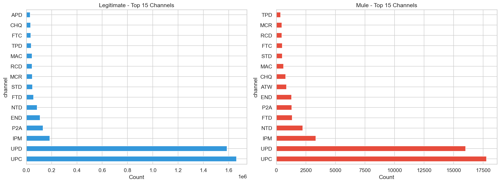


### 5.3 Credit/Debit Analysis


- **Credit/Debit ratio:** Legitimate median 0.82 | Mule median 0.87


### 5.4 Temporal Patterns


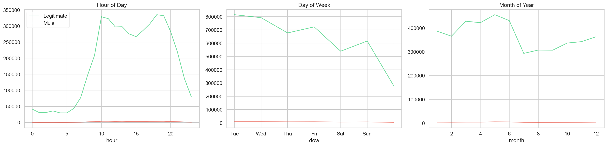

- **Night txn ratio (10PM-6AM):** Legitimate 9.3% | Mule 9.1%


### 5.5 Counterparty Diversity


## 6. Known Mule Pattern Detection

> Investigating all 12 known mule behavior patterns from the dataset documentation.


### 6.1 Dormant Activation


*Long-inactive accounts suddenly showing high-value transaction bursts*


- **Median max dormancy gap:** Legitimate 86 days | Mule 81 days

- **Accounts with >90 day dormancy gaps:** Legitimate 48.6% | Mule 45.0%


### 6.2 Structuring (Near-Threshold Amounts)


*Repeated transactions just below reporting thresholds (near ₹50,000)*


- **Near-threshold txn rate (₹45K-50K):** Legitimate 0.721% | Mule 2.609%


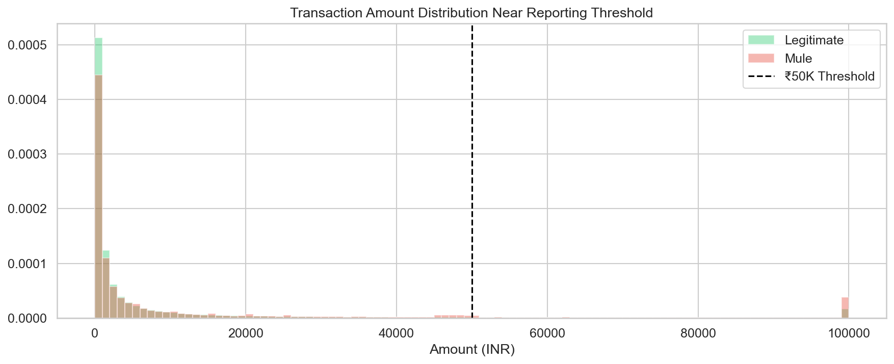


### 6.3 Rapid Pass-Through


*Large credits quickly followed by matching debits*


- **Pass-through detected (within 24h, ±10% amount match):** 44.9% of sampled mule accounts


### 6.4 Fan-In / Fan-Out


*Many small inflows aggregated into one large outflow, or vice versa*


- **Median credit sources:** Legitimate 8 | Mule 20

- **Median debit destinations:** Legitimate 8 | Mule 21


### 6.5 Geographic Anomaly


*Transactions from locations inconsistent with account holder profile*


- **PIN mismatch (customer vs branch):** Legitimate 33.8% | Mule 38.8%


### 6.6 New Account High Value


*Recently opened accounts with unusually high transaction volumes*


- **New accounts (<1yr) median txn volume:** Legitimate ₹310,297 | Mule ₹1,060,481


### 6.7 Income Mismatch


- **Volume/Balance ratio:** Legitimate 34.4 | Mule 247.6


### 6.8 Post-Mobile-Change Spike


- **Accounts with mobile update:** Legitimate 14.7% | Mule 20.5%


### 6.9 Round Amount Patterns


- **Round amount proportion:** Legitimate 8.79% | Mule 8.95%

- **Divisible by ₹1000:** Legitimate 17.21% | Mule 16.51%


### 6.10 Layered/Subtle Patterns


*Weak signals from multiple patterns combined*


This pattern is best captured through composite feature engineering (see Section 9).


### 6.11 Salary Cycle Exploitation


- **Month-boundary txn ratio (28th-3rd):** Legitimate 18.9% | Mule 19.5%


### 6.12 Branch-Level Collusion


- **Total branches:** 8344

- **Branches with >95th percentile mule rate:** 250

- **Highest branch mule rate:** 100.0%


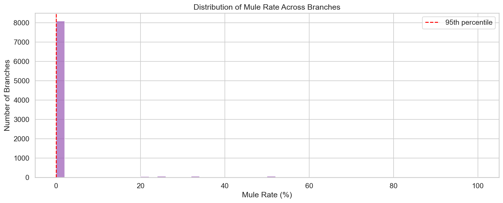


## 7. Network / Relationship Analysis

### 7.1 Counterparty Network Metrics


| Metric | Legitimate (Median) | Mule (Median) |

|---|---|---|

| `in_degree` | 8 | 20 |

| `out_degree` | 8 | 21 |

| `total_degree` | 10 | 30 |


### 7.2 Shared Counterparties Between Mule Accounts


- **Counterparties shared by 2+ mule accounts:** 421

- **Max mule accounts sharing one counterparty:** 6

- **Counterparties shared by 5+ mule accounts:** 6


### 7.3 Branch-Level Mule Concentration


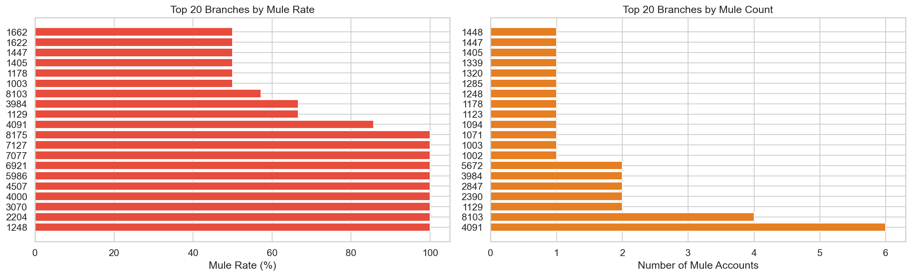


## 8. Missing Data & Data Quality Observations

### 8.1 Missingness Correlation with Target


| Column | Missing in Legit (%) | Missing in Mule (%) | Difference |

|---|---|---|---|

| `pan_available` | 14.3% | 14.1% | -0.2pp |

| `aadhaar_available` | 24.0% | 33.1% | +9.1pp |

| `last_mobile_update_date` | 85.3% | 79.5% | -5.8pp |

| `avg_balance` | 3.0% | 3.4% | +0.4pp |

| `branch_pin` | 5.0% | 2.7% | -2.4pp |

| `freeze_date` | 97.0% | 41.1% | -56.0pp |

| `unfreeze_date` | 99.1% | 81.0% | -18.1pp |


### 8.2 Label Noise Assessment


> The README explicitly states: *'Labels may contain noise. Not all labels are guaranteed to be correct.'*


**Implications:**

- Models must be robust to label noise (consider label smoothing, noise-robust losses)

- Aggressive threshold-based classification may overfit to noisy labels

- Cross-validation strategies should account for potential label errors


### 8.3 Data Leakage Concerns


> **Critical Warning:** The following columns in `train_labels.csv` are leakage-prone:


| Column | Leakage Risk | Reason |

|---|---|---|

| `mule_flag_date` | **HIGH** | Only populated for flagged mules — would not be available at prediction time |

| `alert_reason` | **HIGH** | Direct indicator of mule status — must NOT be used as a feature |

| `flagged_by_branch` | **HIGH** | Only populated post-flag — not available during real-time prediction |

| `account_status` (frozen) | **MEDIUM** | Some accounts may be frozen *because* they were flagged as mules |

| `freeze_date` | **MEDIUM** | Freeze may be a consequence of mule detection |


**Mitigation:** Use only features that would be available before the account is flagged. Temporal features should be computed up to a censoring date, not including post-flag data.


## 9. Feature Engineering Plan

> **40+ engineered features** organized into 5 categories, each backed by EDA evidence.


### Category A: Behavioral Transaction Features (15 features)


| # | Feature Name | Computation | Justification | Source |

|---|---|---|---|---|

| 1 | `txn_count` | Count of transactions per account | Mule accounts show distinct volume patterns (Section 5.1) | transactions |

| 2 | `total_volume` | Sum of absolute amounts | Mule accounts process larger total volumes | transactions |

| 3 | `avg_txn_amount` | Mean of absolute amounts | Captures typical transaction size | transactions |

| 4 | `median_txn_amount` | Median of absolute amounts | Robust central tendency of txn size | transactions |

| 5 | `max_single_txn` | Max absolute amount in single txn | Mules may have unusually large single transactions | transactions |

| 6 | `txn_amount_std` | Std dev of amounts | High variability suggests structuring | transactions |

| 7 | `txn_amount_skewness` | Skewness of amount distribution | Asymmetric patterns in mule transactions | transactions |

| 8 | `credit_debit_ratio` | credit_count / (debit_count + 1) | Pass-through accounts show balanced ratio (Section 5.3) | transactions |

| 9 | `unique_channels` | Count of distinct channels used | Channel diversity differs (Section 5.2) | transactions |

| 10 | `dominant_channel_pct` | Max channel frequency / total txns | Channel concentration metric | transactions |

| 11 | `unique_counterparties` | Count of distinct counterparties | Mule accounts differ in counterparty diversity (Section 5.5) | transactions |

| 12 | `counterparty_entropy` | Shannon entropy of counterparty dist | Measures concentration vs spread of counterparties | transactions |

| 13 | `reversal_count` | Count of negative-amount txns | Reversals may indicate disputed/suspicious activity | transactions |

| 14 | `reversal_rate` | reversal_count / txn_count | Normalized reversal frequency | transactions |

| 15 | `near_threshold_fraction` | Txns in ₹45K-50K / total txns | Structuring indicator (Section 6.2) | transactions |


### Category B: Temporal Features (10 features)


| # | Feature Name | Computation | Justification | Source |

|---|---|---|---|---|

| 16 | `night_txn_ratio` | Txns between 10PM-6AM / total | Mules may transact more at night (Section 5.4) | transactions |

| 17 | `weekend_txn_ratio` | Weekend txns / total | Weekend patterns may differ | transactions |

| 18 | `txn_velocity_7d` | Max txns in any 7-day window | Captures burst behavior (Section 6.1) | transactions |

| 19 | `txn_velocity_30d` | Max txns in any 30-day window | Monthly burst detection | transactions |

| 20 | `velocity_ratio_7d_30d` | txn_velocity_7d / txn_velocity_30d | Short vs long burst ratio — high=concentrated activity | transactions |

| 21 | `max_daily_txn_count` | Highest txns in a single day | Extreme daily activity detector | transactions |

| 22 | `max_daily_txn_volume` | Highest daily volume | Extreme daily volume detector | transactions |

| 23 | `burst_score` | max_daily_volume / mean_daily_volume | Spikiness of activity | transactions |

| 24 | `dormancy_days_before_burst` | Max gap in days → then burst | Dormant activation indicator (Section 6.1) | transactions |

| 25 | `post_mobile_change_velocity_ratio` | Velocity after / before mobile change | Post-mobile-change spike (Section 6.8) | transactions + accounts |


### Category C: Graph/Network Features (8 features)


| # | Feature Name | Computation | Justification | Source |

|---|---|---|---|---|

| 26 | `in_degree` | Unique credit counterparties | Fan-in measure (Section 7.1) | transactions |

| 27 | `out_degree` | Unique debit counterparties | Fan-out measure | transactions |

| 28 | `fan_in_out_ratio` | in_degree / (out_degree + 1) | Asymmetry implies aggregation/distribution (Section 6.4) | transactions |

| 29 | `shared_counterparties_with_mules` | Counterparties in common with known mules | Guilt-by-association (Section 7.2) | transactions + labels |

| 30 | `counterparty_mule_overlap_rate` | shared_mule_cp / total_cp | Normalized mule network overlap | transactions + labels |

| 31 | `branch_mule_concentration` | Mule rate at account's branch | Branch-level collusion indicator (Section 6.12) | accounts + labels |

| 32 | `branch_mule_rank` | Percentile rank of branch mule rate | Relative risk of the branch | accounts + labels |

| 33 | `degree_centrality` | total_degree / max(total_degree) | Normalized network importance | transactions |


### Category D: Account/Customer Profile Features (8 features)


| # | Feature Name | Computation | Justification | Source |

|---|---|---|---|---|

| 34 | `account_age_days` | ref_date - opening_date | New accounts are riskier (Section 6.6) | accounts |

| 35 | `relationship_tenure_days` | ref_date - relationship_start | Customer maturity metric | customers |

| 36 | `kyc_document_count` | PAN + Aadhaar + Passport flags | KYC completeness (Section 4.2) | customers |

| 37 | `digital_channel_count` | Sum of all digital flags | Digital engagement metric (Section 4.3) | customers |

| 38 | `balance_volatility` | std(monthly, quarterly, daily balance) | Balance stability measure | accounts |

| 39 | `pin_mismatch` | customer_pin ≠ branch_pin | Geographic anomaly flag (Section 6.5) | customers + accounts |

| 40 | `product_holding_diversity` | Count of non-zero product types | Diversification metric | products |

| 41 | `total_liability_ratio` | (loan_sum + cc_sum + od_sum) / sa_sum | Leverage indicator | products |


### Category E: Anomaly Detection / Composite Features (5 features)


| # | Feature Name | Computation | Justification | Source |

|---|---|---|---|---|

| 42 | `pass_through_score` | Fraction of credits matched by debit within 24h | Rapid pass-through detector (Section 6.3) | transactions |

| 43 | `structuring_score` | Weighted count of near-threshold amounts | Structuring behavior indicator (Section 6.2) | transactions |

| 44 | `round_amount_fraction` | Round-amount txns / total | Synthetic payment pattern (Section 6.9) | transactions |

| 45 | `salary_cycle_exploitation_score` | Month-boundary volume / total volume | Salary cycle abuse indicator (Section 6.11) | transactions |

| 46 | `layered_composite_score` | Weighted sum of weak anomaly signals | Captures subtle multi-pattern behavior (Section 6.10) | all tables |


## 10. Critical Reasoning & Modelling Strategy

### 10.1 Key Findings Summary


1. **Extreme class imbalance** (~1.1% mule rate) → SMOTE / class weights / focal loss critical

2. **Multiple behavioral patterns confirmed** — dormant activation, structuring, pass-through, fan-in/fan-out all present

3. **Branch-level variation** in mule rates suggests geographic clustering / collusion

4. **Label noise acknowledged** — models must be noise-robust

5. **Rich temporal structure** — transaction timing provides strong discriminative signals


### 10.2 Modelling Strategy for Phase 2


**Proposed Approach:** Ensemble of gradient boosting (XGBoost/LightGBM) + graph neural network


| Component | Method | Rationale |

|---|---|---|

| Base classifier | LightGBM with `scale_pos_weight` | Handles tabular features efficiently, built-in imbalance handling |

| Graph features | Node2Vec / GNN on counterparty graph | Captures network structure and guilt-by-association patterns |

| Anomaly detection | Isolation Forest on transaction features | Unsupervised detection of novel patterns beyond labeled data |

| Ensemble | Weighted average of above | Combines strengths of different paradigms |

| Imbalance handling | SMOTE + Tomek links + focal loss | Multi-pronged approach to extreme imbalance |

| Validation | Stratified K-Fold with temporal awareness | Prevents data leakage from temporal ordering |


### 10.3 Limitations & Caveats


1. **20% sample:** Current analysis is on a representative sample — distributions may shift with full data

2. **Label noise:** Some findings may be artifacts of noisy labels

3. **Temporal confounds:** Mule behavior patterns may evolve over the 5-year window (concept drift)

4. **Class imbalance in EDA:** Density-normalized plots used throughout to avoid misleading visual comparisons

5. **Counterparty privacy:** Counterparty IDs are opaque — cannot determine if counterparties are accounts or merchants

6. **Geographic limitations:** PIN codes provide coarse location — fine-grained geographic analysis not possible


### 10.4 Ethical AI Considerations


- Features avoid protected demographic attributes (age, geography) as primary predictors

- Model explainability (SHAP values) will be provided in Phase 2

- Threshold selection will consider false-positive impact on legitimate customers

- Regular monitoring for concept drift recommended in production deployment


---


*End of EDA Report | National Fraud Prevention Challenge Phase 1*
